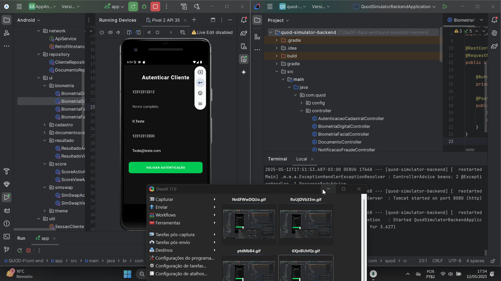
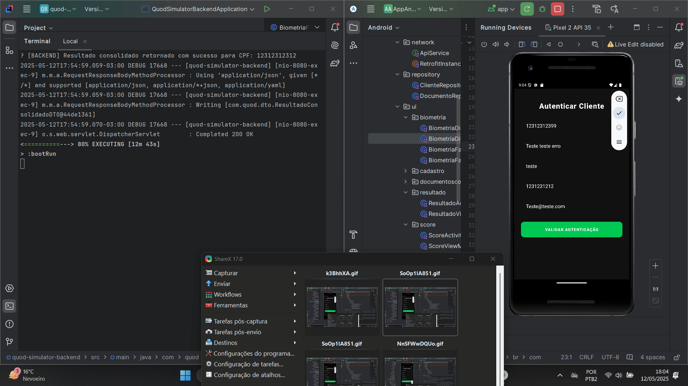

# 🔐 QUOD Antifraude – API Backend (Java + Spring Boot)

Este repositório contém a **API antifraude** desenvolvida com Spring Boot. Ele representa a parte lógica e central do sistema antifraude criado para o **Challenge da FIAP 2025 em parceria com a QUOD**, simulando o funcionamento de um serviço antifraude real.

> 🔗 Esta API é consumida pelo app mobile disponível no repositório:  
> [FIAP_QuOD-Frontend](https://github.com/Joao-Markus-Barbosa/FIAP_QuOD-Frontend)

---

## 🎯 Objetivo

- Processar requisições antifraude simuladas
- Realizar validações sobre dados recebidos (imagem, CPF, etc.)
- Simular falhas baseadas em padrões de CPF
- Armazenar eventos em banco NoSQL para rastreabilidade
- Retornar os resultados para o app de forma clara

---

## 🧠 Lógica de Funcionamento

1. O app envia requisições POST com dados (CPF + imagem base64)
2. O backend identifica se há indícios de fraude:
   - CPF termina com `9` → deepfake facial
   - CPF termina com `8` → impressão digital mascarada
   - CPF termina com `7` → documento forjado
   - Imagem vazia → falha automática
3. Os dados são armazenados no **MongoDB**
4. Em caso de fraude, o sistema gera uma notificação interna simulada
5. O resultado consolidado é atualizado e devolvido ao front

---

## ⚙️ Tecnologias Utilizadas

- Java 17
- Spring Boot
  - Web
  - Validation
  - Data MongoDB
- MongoDB (NoSQL)
- Lombok
- Swagger (Springdoc OpenAPI)
- Jakarta Validation

---

## 🧩 Estrutura do Projeto

```
src/
├── controller/
├── service/
├── repository/
├── model/
├── dto/
└── QuodSimulatorBackendApplication.java
```

---

## 🔗 Integração Fullstack

Esta aplicação representa a parte **back-end de um sistema Fullstack antifraude**:

- O app (Kotlin) envia os dados para validação
- A API executa a lógica antifraude e armazena os dados
- O banco MongoDB registra tudo para análise e rastreabilidade
- O resultado retorna para o app em tempo real

---
## 📊 Demonstrações (GIFs)

### ✅ Fluxo com Sucesso


### ❌ Fluxo com Falha (CPF termina em 9, 8 ou 7)

---

O front-end está disponível em:  
[FIAP_QuOD-Frontend](https://github.com/Joao-Markus-Barbosa/FIAP_QuOD-Frontend)

---

## 🧾 Licença

Projeto acadêmico Challenge – FIAP 2025  
Parceria com: **QUOD - Soluções Antifraude**
